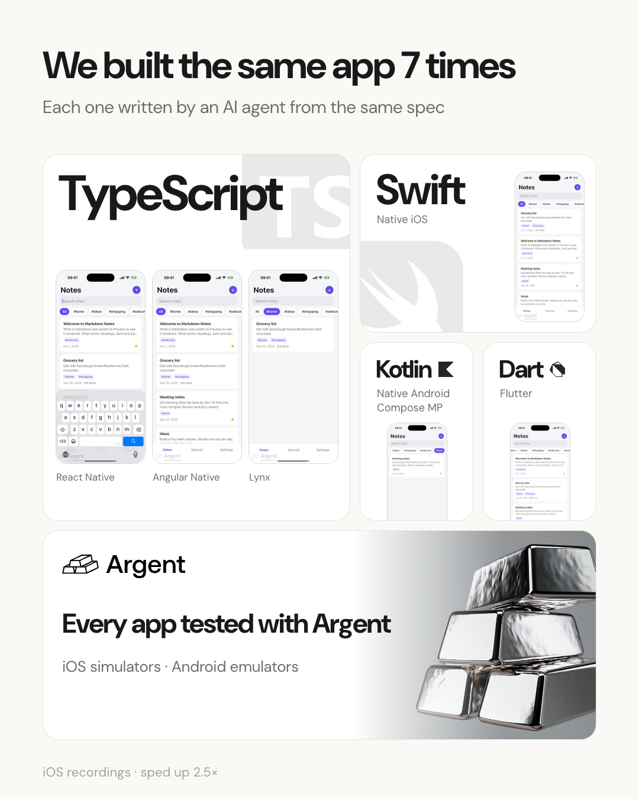
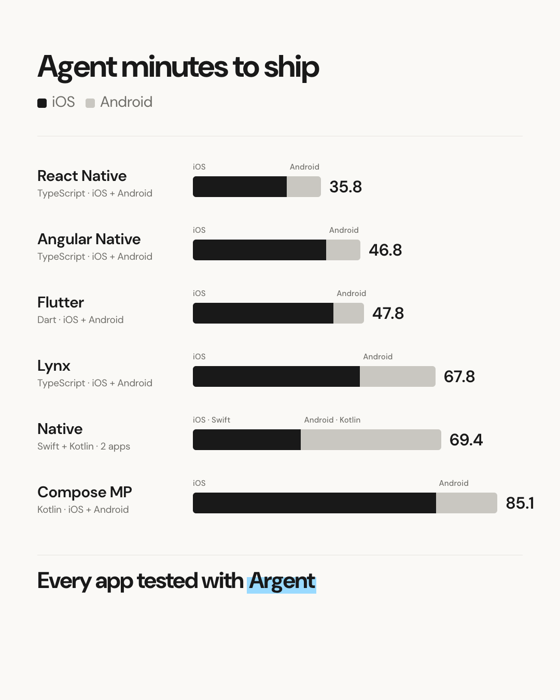
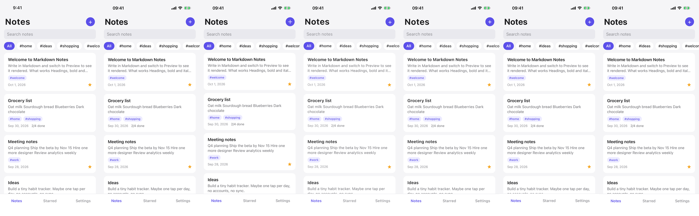
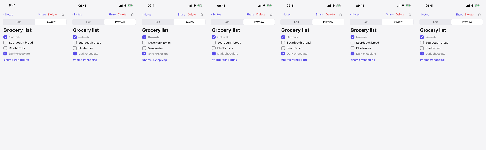
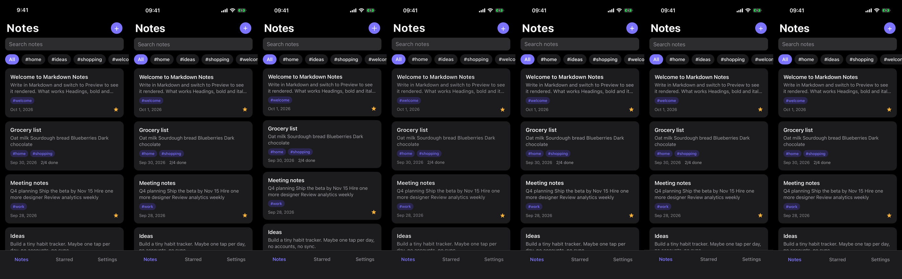

# One app, seven codebases, built by agents



The same **Markdown Notes** app built by AI agents (Claude Opus 5.5) seven times, in four languages:
**[Swift](https://developer.apple.com/swift/)** (iOS) and **[Kotlin](https://developer.android.com/kotlin)** (Android) native apps,
**[Angular Native](https://ng-native.com)**, **[Compose Multiplatform](https://www.jetbrains.com/compose-multiplatform/)**,
**[Flutter](https://flutter.dev)**, **[Lynx](https://lynxjs.org)** and **[React Native](https://reactnative.dev) ([Expo](https://expo.dev))**.
Each was grown through five product changes and shipped on iOS and Android. Every agent ran and tested its own app on a
simulator or emulator with **[Argent](https://argent.swmansion.com)**.

[`swift/`](swift) · [`kotlin/`](kotlin) · [`angular-native/`](angular-native) · [`kmp/`](kmp) ·
[`flutter/`](flutter) · [`lynx/`](lynx) · [`react-native/`](react-native)

## Results

### Shipping iOS + Android



| | Agent minutes | Tool calls | Tokens (mostly cached) | API cost (est.)³ | Codebases |
|---|---|---|---|---|---|
| React Native | 35.8 (26.2 iOS + 9.6 Android) | 220 | 35M | ~$10–12 | 1 |
| Angular Native | 46.8 (37.2 + 9.6) | 300 | 51M | ~$14–16 | 1 |
| Flutter | 47.8 (39.3 + 8.5) | 321 | 61M | ~$16–18 | 1 |
| Lynx | 67.8 (46.7 + 21.1) | 369 | 73M | ~$21–23 | 1 |
| Native (Swift + Kotlin) | 69.4 (30.2 + 39.2) | 330 | 64M | ~$18–21 | 2 |
| Compose Multiplatform | 85.1 (67.9 + 17.2) | 309 | 66M | ~$17–20 | 1 |

Native is two apps, so its total is a Swift app plus a Kotlin app. The cross-platform stacks reused their code and took
8.5–21.1 minutes to port to Android. One run per stack, so differences of a few minutes are noise (see [Caveats](#caveats)).

### What each stack did best

- **Swift:** smallest iOS app (1.6 MB download, 4.0 MB installed) and the fewest lines of code (1,573)
- **Kotlin:** smallest Android APK (1.4 MB)
- **Compose Multiplatform:** closest match to the design (layout SSIM 0.998)
- **Flutter:** quickest Android port (8.5 min)
- **Lynx:** second-smallest iOS app (4.6 MB download) and the fastest 5 changes after React Native (14.0 min)
- **Angular Native:** second-fastest to ship both platforms (46.8 min) while still in alpha
- **React Native:** fastest to ship both platforms (35.8 min)

### iOS

| | Swift | React Native | Flutter | Compose MP | Angular Native | Lynx |
|---|---|---|---|---|---|---|
| Agent minutes: first build | 15.0 | 13.7 | 21.1 | 34.4 | 16.7 | 32.7 |
| Agent minutes: 5 changes | 15.2 | 12.6 | 18.2 | 33.5 | 20.5 | 14.0 |
| Minutes waiting on builds | 9.3 | 6.2 | 8.4 | 39.9 | 13.3 | 16.8 |
| Hidden QA checks passed (of 32) | 32 | 26¹ | 32 | 32 | 31² | 24¹ |
| Functional bugs | 0 | 0 | 0 | 0 | 0 | 0 |
| Match to design (layout SSIM) | 0.861 | 0.940 | 0.984 | **0.998** | 0.916 | 0.931 |
| Crashes in 15,000 random taps | 0 | 0 | 0 | 0 | 0 | 0 |
| Lines of app code (agent-written) | **1,573** | 1,586 | 2,066 | 1,863 | 1,817 | 2,029 |

¹ Accessibility only: note-card contents are hidden from VoiceOver (and Lynx's text inputs can't take
assistive-tech focus). Every feature behind those checks works; see
[React Native](results/react-native/qa-review.md) and [Lynx](results/lynx/qa-review.md).
² One check (search) failed once and passed 3/3 re-runs ([review](results/angular-native/qa-review.md)).

### On a real iPhone 16

Release builds, App Store-thinned, cold launches ([method](results/device/README.md),
[time to content](results/device/time-to-content.md)):

| | Swift | React Native | Flutter | Compose MP | Angular Native | Lynx |
|---|---|---|---|---|---|---|
| Time until the notes list is on screen | ~0.10 s | ~0.09–0.14 s | ~0.45–0.7 s | ~0.12 s | ~0.13 s | ~0.11–0.12 s |
| Download size | **1.6 MB** | 8.6 MB | 7.2 MB | 10.8 MB | 9.4 MB | 4.6 MB |
| Installed size | **4.0 MB** | 29.0 MB | 17.2 MB | 30.0 MB | 31.0 MB | 11.2 MB |
| Android APK (arm64) | 1.4 MB (Kotlin) | 28.5 MB | 17.0 MB | 7.0 MB | 30.3 MB | 25.4 MB |

Time to content runs from kernel process start to the first frame with the list drawn (median of 20
cold launches, checked against on-device screenshots). Five stacks show the list in about a tenth of a
second; Flutter takes about half a second. Size is native's clear win (Kotlin's APK is R8-minified).

## Do they look the same?

Spec, then React Native, Swift, Flutter, Compose MP, Angular Native, Lynx (the order of the comparison images):





Walkthrough videos: [`results/videos/`](results/videos).

## How it was built and measured

- **Spec:** [`spec/SPEC.md`](spec/SPEC.md) with pixel references; a third-party Markdown parser and
  SQLite are required. Five change requests followed one at a time
  ([`spec/iterations/`](spec/iterations)): tags, checklists, delete with undo, dark mode, share sheet.
- **Agents:** Claude Opus 5.5, one agent per stack with the same prompt
  ([`harness/AGENT_PROMPT.md`](harness/AGENT_PROMPT.md)), one at a time on an idle Apple M4 Pro, each
  with its own simulator/emulator driven through Argent. Minutes, tool calls and tokens come from the
  agent transcripts.
- **Android:** each cross-platform app was taken to Android by one more agent
  ([`harness/ANDROID_PROMPT.md`](harness/ANDROID_PROMPT.md)); the native Kotlin app was built through
  the same six versions.
- **QA:** 32 hidden XCUITest checks the agents were instructed not to read ([`harness/xcui`](harness/xcui)); every
  failure was reproduced by hand. Crash test: 15,000 random taps per app.
- **Design match:** screenshots of 7 screens compared with the spec ([`harness/fidelity.py`](harness/fidelity.py)).
- **API cost:** ³ Claude Opus 5.5 rates ($4/M input, $5/M cache writes, $0.20/M cache reads,
  $20/M output) applied to the transcripts' token usage; output tokens are estimated from the visible
  text and tool calls, so the range uses 1× and 3× that estimate.

## Caveats

- One run per stack; differences of a few minutes are noise.
- Each agent chose its own libraries and architecture, so this measures "an agent building this app
  in stack X", not the ceiling of stack X.
- Design match is measured against Chrome-rendered mockups, which favours stacks that render text
  like Chrome (Flutter, Compose).
- The spec requires custom-drawn controls (no UIKit or Material chrome), so every app looks the
  same and native's built-in components weren't used.
- Design match penalises small spacing differences that add up down a list (Swift's cards are a few
  points shorter, which lowers its score while looking near-identical).
- Angular Native is alpha (0.3).

## Repository

```
spec/        the spec, change requests and reference images
<stack>/     the seven apps, each with BUILD.md (and ANDROID.md for the ports)
harness/     prompts, QA tests and measurement scripts
results/     numbers, screenshots, comparison grids, device results, videos
```
